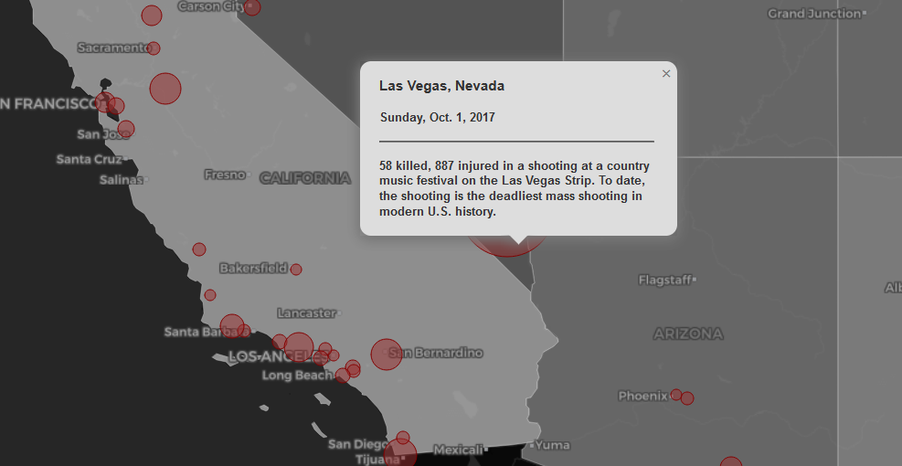

# Patterns of Mass Shootings in the US

## A Data-Driven Approach to Understanding the Impacts of Gun Laws and Gun Ownership on Mass Shooting Incidents 

## Table of Contents

- [Data Sources](#Data-Sources)
    - [Gun Law Data](#Gun-Law-Data)
    - [Gun Ownership Data](#Gun-Ownership-Data)
    - [Mass Shooting Data](#Mass-Shooting-Data)
- [Topic and Geographic Phenomena The Map Will explore](#Topic-and-geographic-phenomena-the-map-will-explore)
- [Map Objectives and User Needs](#Map-objectives-and-user-needs)

## Data Sources

[^](#table-of-contents) 

### Gun Law Data

The gun law data used in this project was obtained from the [Rand Corporation](https://www.rand.org/pubs/tools/TL354.html). This database contains state-level information on background check laws and permit to purchase laws, along with estimates of household firearm ownership from 1980 to 2015.

### Gun Ownership Data

The gun ownership data used in this project was also obtained from the [Rand Corporation](https://www.rand.org/pubs/tools/TL354.html) database mentioned above. This dataset provides state-level estimates of household firearm ownership from 1980 to 2015.

### Mass Shooting Data

Mass shooting data was acquired from [The Violence Project (TVP)](https://www.theviolenceproject.org/), which maintains an extensive and up-to-date database of mass shootings in the US from 1966 to 2021. This dataset includes detailed information on the incidents, shooters, and locations, allowing for comprehensive analysis and visualization.

## Topic and Geographic Phenomena The Map Explores

[^](#table-of-contents)

This project aims to explore potential patterns in mass shooting incidents, gun laws, and gun ownership across the United States from 1966 to 2021. The goal is to provide insights into possible correlations between these factors and build awareness of the increases in mass shootings over time.

The project primarily focuses on the geographic patterns of mass shootings in the US. It uses prop symbols to visualize shooting incidents and choropleth layers to visualize gun laws and gun ownership rates. Featured incidents are highlighted using icons and can be explored through popups or info boxes displaying additional information.

## Map Objectives and User Needs

[^](#table-of-contents)

The primary objective of this project is to provide users with a comprehensive and interactive way to explore the patterns of mass shootings in the US, while also investigating the potential relationships between gun laws, gun ownership, and these incidents.

This map aims to:

- Visualize potential patterns in mass shooting data.
- Build awareness of increases in mass shootings over time.
- Provide a reference to the history of gun ownership and gun laws in the user's area of interest.
- Explore any potential correlation between mass shootings and gun ownership/gun laws.

In addition to the main map, data sources are available through a modal, offering users further context and information.